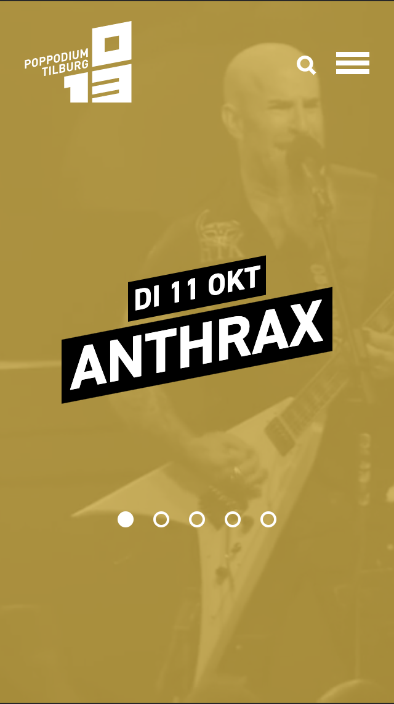
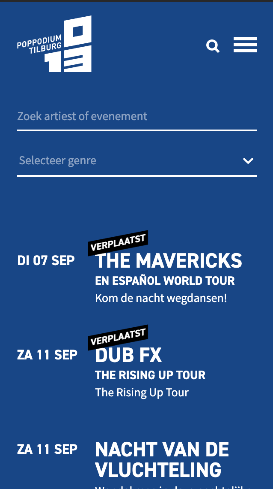
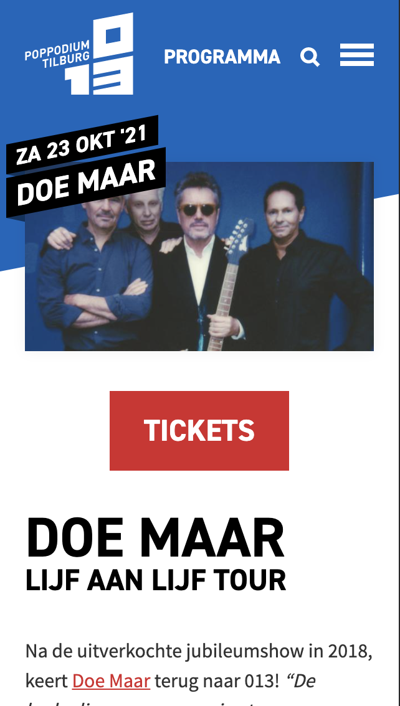
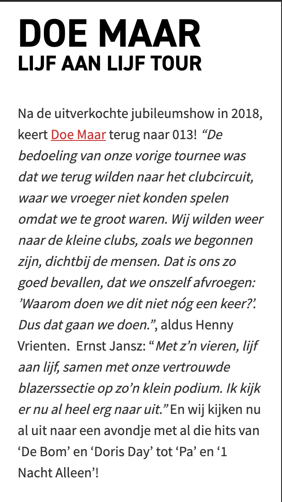
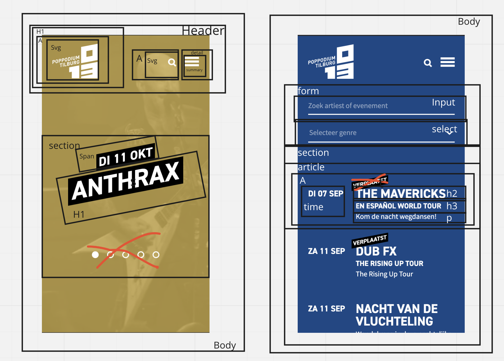
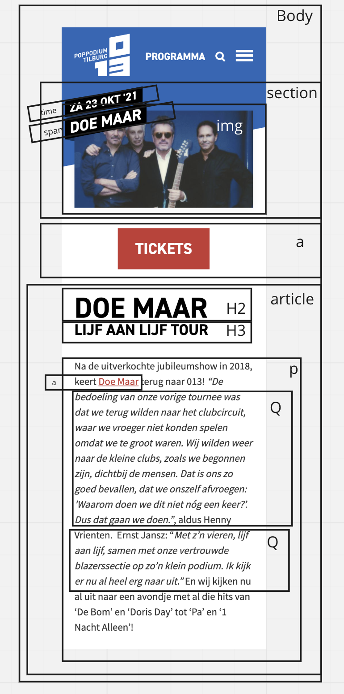

# Procesverslag
Markdown is een simpele manier om HTML te schrijven.  
Markdown cheat cheet: [Hulp bij het schrijven van Markdown](https://github.com/adam-p/markdown-here/wiki/Markdown-Cheatsheet).

Nb. De standaardstructuur en de spartaanse opmaak van de README.md zijn helemaal prima. Het gaat om de inhoud van je procesverslag. Besteedt de tijd voor pracht en praal aan je website.

Nb. Door *open* toe te voegen aan een *details* element kun je deze standaard open zetten. Fijn om dat steeds voor de relevante stuk(ken) te doen.

## Jij

uitwerken voor kick-off werkgroep

### Auteur:
Mik Sluijs

#### Je startniveau:
Blauw

#### Je focus:
surface plain
 

## Je website

uitwerken voor kick-off werkgroep

### Je opdracht:
https://www.013.nl/

#### Screenshot van de eerste pagina (small screen): 
 

#### Screenshot van de tweede pagina (small screen):

 

## Breakdownschets (week 1)

uitwerken na afloop 2e werkgroep

### de hele pagina: 

## Voortgang 1 (week 2)

uitwerken voor 1e voortgang

### Stand van zaken
Ik vond het beginnen eraan heel lastig omdat ik eigenlijk niet zo goed wist waar te beginnen, door de breakdown schetsen werd het wel wat makkelijker maar de html was helemaal weg gezakt dus dat was even lastig. Nu ben ik bezig met de css van pagina een en dat gaat ook niet makkelijk, het lukt vaak wel maar met hulp. Ik heb er een details en summary in gedaan maar ik weet niet hoe ik dit ga maken tot een hamburger menu... Daar wil ik aan beginnen zodra de rest er goed genoeg uit ziet. Ik hoop er dit weekend meer tijd aan te besteden zodat ik er sneller in wordt.

### Agenda voor meeting
samen met je groepje opstellen

| Mik            | Luna               | Reinier      | Lars      |
| ---            |              | ---          | ---              |
| Ik moet vooral tempo maken dat er meer staat | Ik moet proberen minder divs te gebruiken | Button hover verbeteren    | Hoe uberhaupt te beginnen    |
| Hoe maak ik van een details een hamburger menu?| Het menu laten mee scrollen |  |  |
| Hoe krijg je de tekst over een afbeelding? | ...                | ...          | ...              |
  

### Verslag van meeting
hier na afloop snel de uitkomsten van de meeting vastleggen

- Ik ben geholpen met de positie van tekst op een afbeelding
- Iedereen heeft een vraag kunnen stellen waardoor we even verder konden

## Voortgang 2 (week 3)

uitwerken voor 2e voortgang

### Stand van zaken
hier dit ging goed & dit was lastig (neem ook screenshots op van delen van je website en code)

### Agenda voor meeting
samen met je groepje opstellen

| Mik     | Luna         | Reinier   | Lars        |
| ---            | ---                | ---          | ---              |
| Moet alles van de huiswerk opdrachten in de site?  | en dit             | en ik dit    | en dan ik dat    |
| een vak schuin trekken met css? Moet dat dan met een div?| dit als er tijd is | nog een punt | dit wil ik zeker |
| ...            | ...                | ...          | ...              |

### Verslag van meeting
hier na afloop snel de uitkomsten van de meeting vastleggen

-Zorg dat je alles wat voor jou relevant is van het huiswerk, verwerkt in je site. De vraag al opgelost door Reinier maar toen was het toch niet gelukt dus heb ik het de volgende les toch nog aan de docent gevraagd

## Toegankelijkheidstest (week 4)

uitwerken na test in 8e voortgang

### Bevindingen
Lijst met je bevindingen die in de test naar voren kwamen:

#### Titel eerste bevinding
Hier korte omschrijving (met indien nodig een afbeelding)

Hier een omschrijving van hoe het opgelost kan worden (met indien nodig een afbeelding)

#### Titel tweede bevinding. 
Hier korte omschrijving (met indien nodig een afbeelding)

Hier een omschrijving van hoe het opgelost kan worden (met indien nodig een afbeelding)

#### Titel volgende bevinding. 
Hier korte omschrijving (met indien nodig een afbeelding)

Hier een omschrijving van hoe het opgelost kan worden (met indien nodig een afbeelding)

#### Titel nog een bevinding. 
Hier korte omschrijving (met indien nodig een afbeelding)

Hier een omschrijving van hoe het opgelost kan worden (met indien nodig een afbeelding)

## Voortgang 3 (week 4)

uitwerken voor 3e voortgang

### Stand van zaken
hier dit ging goed & dit was lastig (neem ook screenshots op van delen van je website en code)

### Agenda voor meeting
samen met je groepje opstellen

| Mik            | Luna         | Reinier   | Lars       |
| ---            | ---                | ---          | ---              |
| door de focus komt nu bij het hamburgermenu een border, verpest de 'animatie' een beetje...  | en dit    |   | en dan ik dat    |
|  | dit als er tijd is | nog een punt | dit wil ik zeker |
|             | ...                | ...          | ...              |

### Verslag van meeting
hier na afloop snel de uitkomsten van de meeting vastleggen

- punt 1
- punt 2
- nog een punt
- ...

## Eindgesprek (week 5)

uitwerken voor eindgesprek

### Stand van zaken
hier dit ging goed & dit was lastig (neem ook screenshots op van delen van je website en code)

### Screenshot(s)

hier screenshot(s) van je eindresultaat

## Bronnenlijst

continu bijhouden terwijl je werkt

Nb. Wees specifiek ('css-tricks' als bron is bijv. niet specifiek genoeg).

1. bron 1
2. bron 2
3. ...

