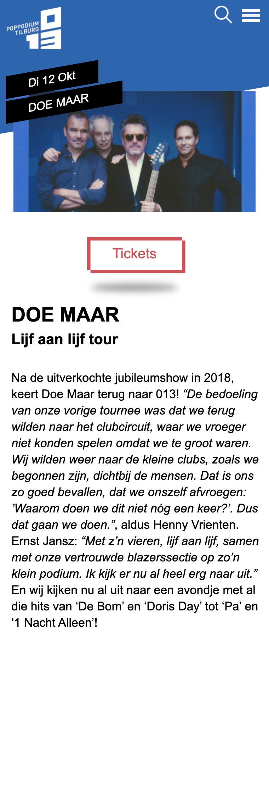

## Proces verslag FED Mik Sluijs

Nb. Door *open* toe te voegen aan een *details* element kun je deze standaard open zetten. Fijn om dat steeds voor de relevante stuk(ken) te doen.

## Jij

### Auteur:
Mik Sluijs

#### Je startniveau:
Blauw

#### Je focus:
surface plain
 

## Je website

### Mijn opdracht:
https://www.013.nl/

#### Screenshot van de eerste pagina (small screen): 
 

#### Screenshot van de tweede pagina (small screen):

 

## Breakdownschets (week 1)

 
 Mijn breakdownschets 

### de hele pagina: 

## Voortgang 1 (week 2)

1e voortgang

### Stand van zaken
Ik vond het beginnen eraan heel lastig omdat ik eigenlijk niet zo goed wist waar te beginnen, door de breakdown schetsen werd het wel wat makkelijker maar de html was helemaal weg gezakt dus dat was even lastig. Nu ben ik bezig met de css van pagina een en dat gaat ook niet makkelijk, het lukt vaak wel maar met hulp. Ik heb er een details en summary in gedaan maar ik weet niet hoe ik dit ga maken tot een hamburger menu... Daar wil ik aan beginnen zodra de rest er goed genoeg uit ziet. Ik hoop er dit weekend meer tijd aan te besteden zodat ik er sneller in wordt.

### Agenda voor meeting
samen met je groepje opstellen

| Mik            | Luna               | Reinier      | Lars      |
| ---            |              | ---          | ---              |
| Ik moet vooral tempo maken dat er meer staat | Ik moet proberen minder divs te gebruiken | Button hover verbeteren    | Hoe uberhaupt te beginnen    |
| Hoe maak ik van een details een hamburger menu?| Het menu laten mee scrollen |  |  |
| Hoe krijg je de tekst over een afbeelding? | ...                | ...          | ...              |
  

### Verslag van meeting

- Ik ben geholpen met de positie van tekst op een afbeelding
- Iedereen heeft een vraag kunnen stellen waardoor we even verder konden

## Voortgang 2 (week 3)

2e voortgang

### Stand van zaken
Ik ben nog helemaal niet zeker van wat ik tot nu toe heb. Al helemaal als ik zie wat de mensen uit mijn groepje al hebben, ookal zaten die al op een hoger niveau, maak ik me best wel zorgen over mijn eigen site. Wel heb ik al heel veel fijne hulp gekregen van wat andere klasgenoten. Ik moet en wil nog heel veel aan mijn site doen maar bij een aantal dingen weet ik niet zo goed hoe. Ik hoop dit in de feedback sessies/ lessen te kunnen vragen.

### Agenda voor meeting
samen met je groepje opstellen

| Mik     | Luna         | Reinier   | Lars        |
| ---            | ---                | ---          | ---              |
| Moet alles van de huiswerk opdrachten in de site?  | responsive deel ging niet lekker | vooral verder werken   | niet aanwezig   |
| een vak schuin trekken met css? Moet dat dan met een div?| |  | |
| ...            | ...                | ...          | ...              |

### Verslag van meeting

-Zorg dat je alles wat voor jou relevant is van het huiswerk, verwerkt in je site. De vraag was al opgelost door Reinier maar toen was het toch niet gelukt dus heb ik het de volgende les toch nog aan de docent gevraagd

## Toegankelijkheidstest (week 4)

 Toegankelijkheid test uitkomsten 

### Bevindingen
Lijst met mijn bevindingen die in de test naar voren kwamen:

#### De zoekbalk en het hamburger menu eigenlijk vrij klein
Bij het testen met de ballon opgooien kwamen we er achter dat het zoek tekentje en het icoontje van 
het hamburger menu vrij klein zijn en je als je snel wordt afgeleid heel erg gefocust moet zijn om op
zo'n kleine button te kunnen klikken.

Door deze bevinding heb ik in mijn eigen site deze twee elementen wat groter gemaakt zodat het minder moeite kost om er op de klikken.

#### De form input en de line heigt en font size is te klein
Bij het testen met de bril die maar 1 klein puntje heeft waar je doorheen kijkt kwamen we erachter dat de placeholder en de select input een wat kleine tekst heeft. Ook is de line heigt en de font size van het grote stuk tekst op de detail pagina te klein is en het met deze beperking moeilijk leesbaar wordt.

Ik heb door deze bevindingen het lettertype van het form vergroot met 2px en de line heigt en font size in mijn site verhoogt. Wat ook een optie zou zijn is de optie geven aan de gebruiker om het lettertype te vergroten als het voor hen nodig is.

#### tekst in het logo is te klein
Met het testen met de bril die een blur heeft was het duidelijk dat de tekst in het logo van 013 veel te klein is. Dit valt namelijk compleet weg met deze bril.

Als ik het logo zou kunnen aanpassen zou ik kijken of deze tekst dus kan vergroten en zo nodig op een andere plek zetten.

#### Screen reader
- Headings
->Bij de headings klopt bijna alles wel. Bij de H2 zorgen dat niet alles in caps is zodat het door de screen reader normaal wordt voorgelezen.
- Links
->Er zijn in de links een aantal afkortingen die ik door de screenreader als volledige woorden zou willen laten uitspreken als ik de tijd had. 
Ook denk ik dat het beter is als bij de articles alleen de "datum, artiest" worden genoemd door de screen reader omdat dit alleen de meest belangrijke informatie is die je nodig hebt om te weten of je verder zou willen kijken.
Ook waren in mijn menu nog niet alle opties een echt linkje waardoor deze ook niet werden voorgelezen door de screen reader, dit heb ik aangepast door alles een linkje naar de home pagina te geven zodat de screenreader deze ziet en voorleest, in de echte site zou deze link natuurlijk naar de betrefende pagina gaan. 
 

## Voortgang 3 (week 4)

3e voortgang

### Stand van zaken
Ik ben redelijk goed op weg, ik heb heel veel vooruitgang gemaakt ten opzichten van vorige week: ik heb pagina 2 bijna af en pagina 1 zo goed als af. Ik wil nog een heleboel toevoegen en daar ben ik ook al mee bezig. Ik heb eigenlijk maar een echte vraag, voor de rest wil ik gewoon door werken. 

### Agenda voor meeting
samen met je groepje opstellen

| Mik            | Luna         | Reinier   | Lars       |
| ---            | ---                | ---          | ---              |
| door de focus komt nu bij het hamburgermenu een border, verpest de 'animatie' een beetje...  | geen vragen gewoon doorwerken   |   | svg animatie laten stoppen   |
|  |  | | |
|             |               |        |             |

### Verslag van meeting

- Dit was de laatste feedback sessie en we hebben allemaal de vragen kunnen stellen die we wilde stellen. Mijn vraag is ook opgelost maar nu zie je ook de :focus niet meer bij het de hamburger menu button, ik denk dat ik dit wel zo laat omdat je in het menu wel alle focus states ziet.

## Eindgesprek (week 5)

### Stand van zaken
Ik denk dat ik in de korte tijd die we hadden voor dit vak en de hoeveelheid skills ik heb op dit vakgebied, iets best oke heb neer gezet. Ik heb heel veel moeite gehad, vooral in het begin, waar begin je? Wat moet waar? En vooral hoe ga ik dit ooit voor elkaar krijgen...? Ik heb veel steun gehad aan mijn mede studenten en de student assistenten heb ik ook vaak om hulp gevraagd, vaak was het een hele makkelijke oplossing maar kon ik er zelf gewoon niet op komen. Dit maakte mij vaak onzeker omdat ik het graag zelf wilde kunnen maar dat ging gewoon echt niet makkelijk. Uiteindelijk heb ik wel heel veel nieuwe dingen gedaan en geleerd, onderandere deze dingen:
 
#### Hier heb ik samen met Ine het hamburger menu laten veranderen naar een kruisje als het open gaat, ik had nooit gedacht dat dit echt ging lukken, maar met een heleboel uitleg is het echt gelukt!
 

 
 #### Ik heb heel lang in het begin moeite gehad met hoe ik nou precies, net als bij de originele site is gedaan, die gloed over het plaatje te krijgen. Maar toch is het gelukt:)
 

 
 #### Ik vond de ticket button op de originele site niet zo super bijzonder dus ik heb met behulp van heel wat googlen een nieuwe button en hover state gemaakt.
 

 
 #### Deze schuine div was niet zo heel moeilijk maar het was voor mij even puzzelen waar de div in de Html moest staan en wat de beste manier was om het schuin te trekken.
 

 

 
### Screenshot(s) 
 (de verhoudingen komen niet mooi uit op de screenshots)

## Bronnenlijst

Mijn bronnenlijst

1. https://codepen.io/miksluijs/pen/OJgqpNb?editors=1100
2. https://www.013.nl/programma/hiphop 
3. https://www.013.nl/
4. https://www.013.nl/programma/6051/doe-maar
5. https://try2explore.com/questions/10020764
6. https://www.youtube.com/watch?v=zuQUlAv45EE 
7. student assistenten, de docent, mede studenten en DLO
8. https://www.youtube.com/watch?v=2QfJQ66b1Os&t=2s
9. https://css-tricks.com/snippets/css/complete-guide-grid/
10. https://css-tricks.com/snippets/css/text-rotation/
11. https://css-tricks.com/snippets/css/a-guide-to-flexbox/
12. https://www.w3schools.com/cssref/pr_border-bottom.asp
13. https://designshack.net/articles/css/12-fun-css-text-shadows-you-can-copy-and-paste/
 

 

